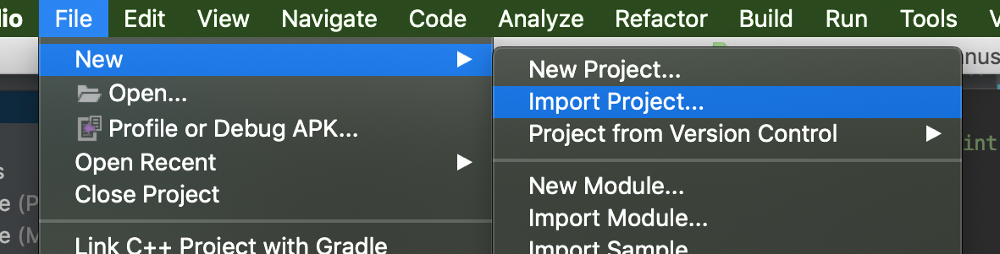

[Meetecho](https://www.meetecho.com) and [@helloiampau](https://github.com/helloiampau) are proud to introduce

<h1 align="center">Janus Client</h1>

the official [janus-gateway](https://github.com/meetecho/janus-gateway) client-side SDK for native environments.

<p align="center">  
  <a href="https://travis-ci.com/helloIAmPau/janus-client">
    
  </a>
  <a href="https://codecov.io/gh/helloIAmPau/janus-client">
    
  </a>
</p>

<p align="center">
  <a href="https://trello.com/b/kyaelRbR/janus-client">Board</a> | <a href="https://github.com/meetecho/janus-gateway">Janus-Gateway</a> | <a href="http://mit.sharats.me/">License</a>
</p>

----

With [janus-client](https://github.com/helloiampau/janus-client) you can build you own WebRTC enabled application for Android, iOS or Desktop.

## Usage

Before start using one of the janus-client SDKs, you need to initialize the project by downloading the dependencies and generating the platform related glue code. But don't worry,  we do all the hard work for you. Just type
```sh
$ make
```
in a terminal from the root folder of the project and wait.

Now it's time to do the real stuff. Import the `janus` project from the folder `platforms/[your-destination-platform]/` into your development IDE and start using it.i
### Configuration

#### Android

Import `platforms/android/janus` project into your workspace. In Android Studio you can do it via main menu:

<p align="center">
  
</p>


The SDK needs some additional permissions and configurations: in your application manifest add

```xml
<uses-permission android:name="android.permission.ACCESS_NETWORK_STATE"/>
<uses-permission android:name="android.permission.INTERNET" />
<uses-permission android:name="android.permission.CAMERA"/>
<uses-permission android:name="android.permission.RECORD_AUDIO"/>
<uses-permission android:name="android.permission.MODIFY_AUDIO_SETTINGS" />
```

and update your `build.gradle` file with:

```gradle
compileOptions {
    compileOptions {
        sourceCompatibility JavaVersion.VERSION_1_8
        targetCompatibility JavaVersion.VERSION_1_8
    }
    sourceCompatibility JavaVersion.VERSION_1_8
    targetCompatibility JavaVersion.VERSION_1_8
}
```

### Janus API

Janus-Client uses the Janus API as default signaling protocol. You can initialize a janus session using the `JanusFactory`:

_Android_
```java
public class MainActivity extends AppCompatActivity {

  @Override
  protected void onCreate(Bundle savedInstanceState) {
    // [...]

    JanusApiConf conf = new JanusApiConf();
    conf.baseUrl('http://my.janus.host');

    Janus janus = JanusFactory.create(activity);
    janus.init(conf, new JanusDelegate() {
      @Override
      public void onJanusError(JanusError error) {
        // Fired when an error occurs
      }

      @Override
      public void onPluginEnabled(String id, Plugin handle, ArgBundle context) {
        // Fired when the client attaches itself to a plugin
      }
    });

    // [...]
  }

}
```

Once initialized the service, you can attach to a plugin by using:

_Android_
```java
// [...]

ArgBundle context = ArgBundle.create();
context.setString("additional", "information");
janus.attach("janus.plugin.apluginname", context);

// [...]
```

Eventually the `onPluginEnabled` callback will fire and you can access to the attached plugin instance.
First things first, you MUST set the plugin delegate in order to receive both the plugin custom events and the webrtc streams.

_Android_
```java
@Override
public void onPluginEnabled(String id, Plugin handle, ArgBundle context) {
  handle.setDelegate(new PluginDelegate() {
    @Override
    public void onEvent(JanusEvent data, ArgBundle context) {
      // Fired when a plugin event should reach the UI
    }

    @Override
    public void onMediaChanged(Media media) {
      // Fired when the media bundle is updated with a new stream
    }

    @Override
    public void onHangup() {
      // Fired when a webrtc session is closed
    }
  });
}
```

You can send commands to the remote janus plugin using the handle you receive into `onPluginEnabled` callback. Each plugin has its own implementation: a list of available commands and arguments is provided later in this document.

_Android_
```java
ArgBundle payload = ArgBundle.create();
payload.setString("argument", "extra");
handle.dispatch("command", payload);
```

When a new video stream is established (either local or remote) it is added to a `Media` bundle and the `onMediaChanged` callback is fired. There you can implement the logic to attach the new stream to a `MediaView`. Briefly, this is achieved by adding to your layout the view:

_Android_
```xml
<?xml version="1.0" encoding="utf-8"?>

<FrameLayout
    xmlns:android="http://schemas.android.com/apk/res/android"
    xmlns:app="http://schemas.android.com/apk/res-auto"
    android:layout_width="match_parent"
    android:layout_height="match_parent">

    <com.github.helloiampau.janus.rtc.MediaView
      android:id="@+id/pip"
      android:name="com.github.helloiampau.janus.app.fragments.VideoView"
      android:layout_width="144dp"
      android:layout_height="256dp"
      android:layout_gravity="bottom|right" />

</FrameLayout>
```

and, in `onMediaChanged` callback:

_Android_
```java
@Override
public void onMediaChanged(Media media) {
  MediaImpl media = (MediaImpl) m;

  if(media.localVideoTrack() != null)
    MediaView pip = layout.findViewById(R.id.pip);
    media.addLocalTrackSink(pip);
  }
}
```

You can close a WebRTC session by calling

_Android_
```java
handle.hangup();
```

detach from a plugin using

_Android_
```java
handle.detach();
```

and close a Janus session, from the janus service object, by calling

_Android_
```java
janus.close();
```

### Custom plugin

You wrote your own janus-gateway plugin and now you need your client to be able to communicate with it using the Janus API.

Janus-Client SDK can be easily extended by implementing two interfaces:

the `PluginFactory` instance is in charge to create the plugin during the janus-client life-cycle

_Android_
```java
public class CustomPluginFactory extends PluginFactory {

  @Override
  public JanusPluginInfo info() {
    return new JanusPluginInfo("my.custom.plugin", "My Awesome Custom Plugin", 0);
  }

  @Override
  public Plugin create() {
    return new CustomPlugin();
  }

}
```

and the plugin itself

_Android_
```java
public class CustomPlugin extends Plugin {

  @Override
  public void dispatch(String command, ArgBundle arguments) {
    // Here you must implement the plugin API
  }

  @Override
  public void onEvent(JanusEvent janusEvent, ArgBundle argBundle) {
    // Fired when wither the remote plugin sends a reply or a new event is received
  }

  @Override
  public void setDelegate(PluginDelegate pluginDelegate) {
    // Here you can store the plugin delegate. You will proxy events to it later.
  }

  @Override
  public void init(Signaling signaling, Peer peer) {
    // Here you receive:
    // a Signaling instance you can use to send commands to the remote plugin.
    // a Peer instance implementing the WebRTC protocol
  }

  @Override
  public void onOffer(String sdp, ArgBundle argBundle) {
    // Fired when an offer is ready
  }

  @Override
  public void onAnswer(String sdp, ArgBundle argBundle) {
    // Fired when an Answer is ready
  }

  @Override
  public void onIceCandidate(Candidate candidate) {
    // Fired when an ice candidate is ready
  }

  @Override
  public void onMediaChanged(Media media) {
    // Fired when the media bundle is updated with a new stream
  }

  @Override
  public void onHangup() {
    // Fired ALWAYS when a WebRTC session is closed
  }

  @Override
  public void hangup() {
    // Should implement the plugin hangup command
  }

  @Override
  public void detach() {
    // Should implement the plugin detach command
  }

}
```

Finally, you can inject your custom plugin by registering it to the janus-client `Platform` obejct

_Android_
```java
Platform platform = JanusFactory.platform();
platform.registerPluginFactory(new CustomPluginFactory());

Janus janus = JanusFactory.create(activity, platform);

// [...]

janus.attach("my.custom.plugin", ArgBundle.create());
```

<p align="center">
  
</p>

### Custom protocol

If you are not using the Janus API at all, you can still use janus-client SDK as a easier cross-platform WebRTC wrapper.
As done for the custom plugin, you need to implement two interfaces:

the `ProtocolFactory` in charge to create the protocol instance

_Android_
```java
public class CustomProtocolFactory extends ProtocolFactory {

  @Override
  public Protocol bootstrap(JanusApiConf hashMap, Platform platform, JanusDelegate janusDelegate) {
    return new CustomProtocol();
  }

}
```

and the `Protocol` itself

_Android_
```java
public class CustomProtocol extends Protocol {

  @Override
  public Info info() {
    return new Info('Custom Protocol', 0);
  }

  @Override
  public ReadyState readyState() {
    return ReadyState.READY;
  }

  @Override
  public void close() {
    // Should implement the close command
  }

  @Override
  public ArrayList<JanusPluginInfo> plugins() {
    // Should return the list of plugins (Optional)
  }

  @Override
  public void attach(String s, ArgBundle argBundle) {
    // Should implement the attach command (Optional)
  }

}
```

__N.W.__ The `Protocol` class is in charge to establish a new session only. The WebRTC and the communication layers MUST be implemented as custom plugin. Take a look to `example/cusotm-api/` for a complete custom api example based on the echotest.

Finally register the new protocol factory to the platform as seen for the plugin:

_Android_
```java
Platform platform = JanusFactory.platform();
platform.registerProtocolFactory(new CustomProtocolFactory());

Janus janus = JanusFactory.create(activity, platform);
```

## Plugins

### Echotest

| Command | Arguments | Description |
|---------|-----------|-------------|
| 'connect' | Bool audio | Try to send and receive local audio |
| | Bool video | Try to send and receive local video |

### Streaming

| Command | Arguments | Description |
|---------|-----------|-------------|
| 'list' | | Get the mountpoint list|
| 'watch' | id | The id of the mountpoit to watch |
|  | offer_audio | Receive audio |
|  | offer_video | Receive video |

### Videoroom

| Command | Arguments | Description |
|---------|-----------|-------------|
| 'list' | | Get the room list|
| 'join' | room | The room id |
|  | display | The publisher display name |
| 'publish' | audio | Send audio |
| | video | Send video |
| 'subscribe' | room | The room id |
| | feed | The feed id |

The `subscribe` command triggers a new onPlugineEnabled event with id `janus.plugin.videoroom.subscriber`. The handle only receives the WebRTC events for the selected feed id.
